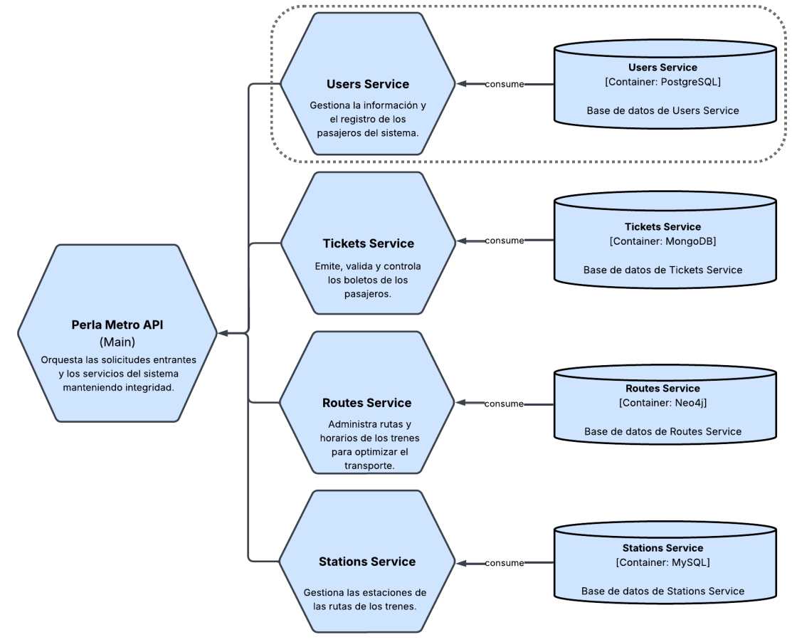
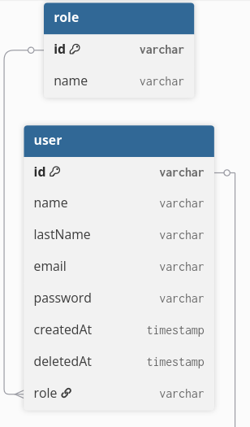

# Users Service - Workshop 1 - System's Architecture

This repository contains the users service used by the **Perla Metro** system from the first workshop of the subject "Arquitectura de Sistemas" at Universidad Católica del Norte. Below are the tools used and how to setup this project locally.

## Pre-requisites

- [.NET SDK](https://dotnet.microsoft.com/es-es/download) (version 9.0.109)
- [PostgreSQL](https://www.postgresql.org/) (version 15.6.0)
- [Git](https://git-scm.com/) (version 2.49.0)
- [Docker or Docker Desktop](https://docs.docker.com/)

**Note**: This project can be setup either using the first three pre-requisites or using only Docker. It is recommended to use just **Docker**.

## Installation and configuration

1. **Clone the repository**

```bash
git clone https://github.com/Taller-1-Arq-de-Sistemas/perla-metro-users-service.git
```

2. **Navigate to the project directory**

```bash
cd perla-metro-users-service
```

## Setup using Docker

3.1. **Create a `.env.development` using the example environment variables file and fill its values**

```bash
cp .env.example .env.development
```

In the `.env.development` file, you can replace:

- `ASPNETCORE_ENVIRONMENT` with Development or Production. For local development keep it as `Development` (enables API docs at `/scalar`).
- `ASPNETCORE_URLS` with the port that the app use to expose the server.
- `ConnectionStrings__AppDb` with the database credentials.
- `JWT_SECRET` with the JWT secret that you want to use.
- `Cors__AllowedOrigins__0` and `Cors__AllowedOrigins__1` with CORS allowed origins for the server.

Once you have replaced everything, save the changes and move on to the next step.

3.2. **Build the project using docker compose**

```bash
docker compose up --build -d
```

A Docker container would be running the web app in the port **8080**

## Setup without Docker

4.1. **Restore project dependencies**

```bash
dotnet restore
```

4.2. **Initialize the user secrets**

```bash
dotnet user-secrets init
```

4.3. **Set the user secrets**

```bash
dotnet user-secrets set "ConnectionStrings:AppDb" "Host=localhost;Port=5432;Database=users;Username=root;Password=root"

dotnet user-secrets set "JWT_SECRET" "YourReallyGoodJWTSecret"
```

**Note (secret values)**: You can change these values to whatever you want, just make sure that these values match to the values in the entire system (like the JWT secret).

**Note (database)**: You need a PostgreSQL database running for this setup, but if you do not have one, you can use Docker to run a PostgreSQL instance, like the one present in the `docker-compose.yaml` file. If you already have Postgres on port 5432 locally, adjust the compose port mapping to avoid conflicts.

4.4 **Run the project**

```bash
# optional: choose a port to match Docker (recommended)
export ASPNETCORE_URLS=http://localhost:8080
dotnet run
```

The server will start on the configured URL (e.g., **8080**) and the **seeders** will be created automatically. Access the API via http://localhost:8080.

## Data seeder

As mentioned in the previous section, the seeders are loaded automatically with the `dotnet run` command.

The seeder contains:

- 252 users (250 randomly generated passengers and 2 identified administrators).

## Operations

The operations that this application exposed are 7 and are separated in two modules: the users module and the authentication module. Below is a detailed overview of these operations:

### Authentication module

In this module we have 2 operations:

- **Register**: This endpoint allows to any user to register in the system as a passenger user. Its specification is like this:

  - URI: auth/register
  - Type: POST
  - Input:
    - Parameters: None
    - Query parameters: None
    - Body:
      - Name: Name of the user.
      - Last names: Last names of the user.
      - Email: Email using Perla Metro domain.
      - Password: Password of the user with at least 8 characters that must include 1 upper letter, 1 lower letter, 1 number and 1 symbol.
  - Response:
    - Status code: 201 if successful.
    - Id: ID of the user.
    - Name: Name of the user.
    - Last names: Last names of the user.
    - Email: Email of the user.
    - Role: Role of the user.
    - Token: JWT created for user authentication.

- **Login**: This endpoint allows to any user registered in the system to login using its credentials. Its specification is like this:

  - URI: auth/login
  - Type: POST
  - Input:
    - Parameters: None
    - Query parameters: None
    - Body:
      - Email: Email of the user.
      - Password: Password of the user.
  - Response:
    - Status code: 200 if successful.
    - Body:
      - Token: JWT created for user authentication.

### Users module

In this module we have 5 operations:

- **Create user**: This endpoint allows to only admins to register a new user in the system. Its specification is like this:

  - URI: user
  - Type: POST
  - Input:
    - Parameters: None
    - Query parameters: None
    - Body:
      - Name: Name of the user.
      - Last names: Last names of the user.
      - Email: Email using Perla Metro domain.
      - Password: Password of the user with at least 8 characters that must include 1 upper letter, 1 lower letter, 1 number and 1 symbol.
      - Role: Role of the user.
  - Response:
    - Status code: 201 if successful
    - Id: ID of the user.
    - Name: Name of the user.
    - Last names: Last names of the user.
    - Email: Email of the user.
    - Role: Role of the user.
    - Status: Status of the user.
    - Created at: Creation date of the user.

- **Get all users**: This endpoint allows to only admins to get all the users in the system. Its specification is like this:

  - URI: user
  - Type: GET
  - Input:
    - Parameters: None
    - Query parameters:
      - Name: Full or partial name of users.
      - Email: Full or partial email address.
      - Status: One of `active` (default), `deleted`, or `all`.
    - Body: None
  - Response: A set of users that includes:
    - Status code: 200 if successful.
    - Id: Id of a user.
    - Full name: Full name of a user.
    - Email: Email of a user.
    - Status: Status of a user.
    - Created at: Creation date of a user.

- **Get a user**: This endpoint allows to only admins to get a user in the system using its ID. Its specification is like this:

  - URI: user/{**id**}
  - Type: GET
  - Input:
    - Parameters:
      - ID: ID of the user to get.
    - Query parameters: None.
    - Body: None
  - Response:
    - Status code: 200 if successful.
    - Id: Id of the user.
    - Name: Name of the user.
    - Last names: Last names of the user.
    - Email: Email of the user
    - Role: Role of the user.
    - Status: Status of the user.
    - Created at: Creation date of the user.

- **Update user**: This endpoint allows to only admins to edit an user in the system. Its specification is like this:

  - URI: user/{**id**}
  - Type: PATCH
  - Input:
    - Parameters:
      - ID: ID of the user to edit.
    - Query parameters: None
    - Body:
      - Name: Name of the user.
      - Last names: Last names of the user.
      - Email: Email using Perla Metro domain.
      - Password: Password of the user with at least 8 characters that must include 1 upper letter, 1 lower letter, 1 number and 1 symbol.
  - Response:
    - Status code: 204 if successful.

- **Delete user**: This endpoint allows to only admins to delete a user in the system (soft delete). Its specification is like this:

  - URI: user/{**id**}
  - Type: DELETE
  - Input:
    - Parameters:
      - ID: ID of the user to delete.
    - Query parameters: None
    - Body: None
  - Response:
    - Status code: 204 if successful.

These operations with their specifications can also be checked in the URI [**scalar**](http://localhost:8080/scalar) when running in the `Development` environment. The OpenAPI JSON is available at `/openapi/v1.json`.

## Error responses

All error responses follow RFC 7807 Problem Details.

- Format: `application/json`
- Fields:
  - Status: HTTP status code.
  - Title: Short error title.
  - Detail: Human-readable description.
  - Instance: Request path.
  - Type: Link to HTTP status class.
  - traceId: Correlation id for diagnostics.
  - code: Short machine-friendly error code (e.g., `not_found`, `duplicate`, `validation_failed`).

## Service architecture

This service is a part of a SOA system mentioned in the beginning (Perla Metro). It is composed by a server made in .NET and a PostgreSQL database like the image shown below.



<br>
The database scheme is composed by 2 tables, a users table and a roles table:

<br>

<center>

</center>

## Design patterns applied

The service uses several patterns to keep the codebase modular, testable, and maintainable:

**Layered (Controller–Service–Repository):** Separates HTTP concerns (Controllers), application/business logic (Services), and persistence (Repositories). Controllers delegate to services; services coordinate repositories and cross-cutting services.

**Unit of Work:** Coordinates repository operations and commits atomically. See `UnitOfWork` exposing `Users` and `Roles` and `SaveChangesAsync`.

**Dependency Injection (IoC):** All dependencies are registered and resolved via the built‑in DI container. See `AddApplicationServices` and `AddWebApp` for service lifetimes (scoped/singleton) and framework services.

**DTO (Data Transfer Object):** Public API types decouple wire contracts from domain models. Request/response DTOs live in `src/DTOs` and are validated via DataAnnotations.

**Mapper (Manual):** Static mapping helpers translate between entities and DTOs for reads/writes. See `Mappers/Users/*` and `Mappers/Auth/*`.

**Middleware:** Cross‑cutting concerns implemented as pipeline middleware, notably `ExceptionHandlerMiddleware` for consistent RFC 7807 error responses.

**Configuration via Extension Methods:** Presentation/infrastructure wiring is grouped in extension methods (`AppServiceExtensions`) to keep `Program.cs` minimal and clarify composition.

**Routing Convention:** `LowercaseParameterTransformer` enforces lowercase route tokens via `RouteTokenTransformerConvention` for consistent URLs.

## Production notes

- Protect endpoints with authorization attributes (e.g., `[Authorize]`) and role-based policies where needed.
- Keep API docs (`/scalar`) disabled in production (default behavior when `ASPNETCORE_ENVIRONMENT=Production`).
- Use a strong `JWT_SECRET` and never commit secrets to the repo. Configure them via environment variables (Render dashboard or deployment environment).
- Configure CORS restricted origins in production using `Cors__AllowedOrigins__*` environment variables.

## Health endpoints

The service exposes standard health endpoints:

- `/healthz`: Liveness probe (process up). No external checks; returns `{ status: "ok" }`.
- `/readyz`: Readiness probe (runs checks tagged as ready, e.g., DB connectivity) with JSON detail.
- `/health`: Full health report for all checks with JSON detail.

Render blueprint is configured to use `/healthz` as health check.

## Metrics

Prometheus metrics are exposed at:

- `/metrics`: standard Prometheus text format, includes default HTTP request duration, count, status code labels, etc.

Example scrape config:

```
scrape_configs:
  - job_name: 'perla-metro-users-service'
    metrics_path: /metrics
    static_configs:
      - targets: ['localhost:8080']
```

## Author

- [@Jairo Calcina](https://github.com/Broukt)
